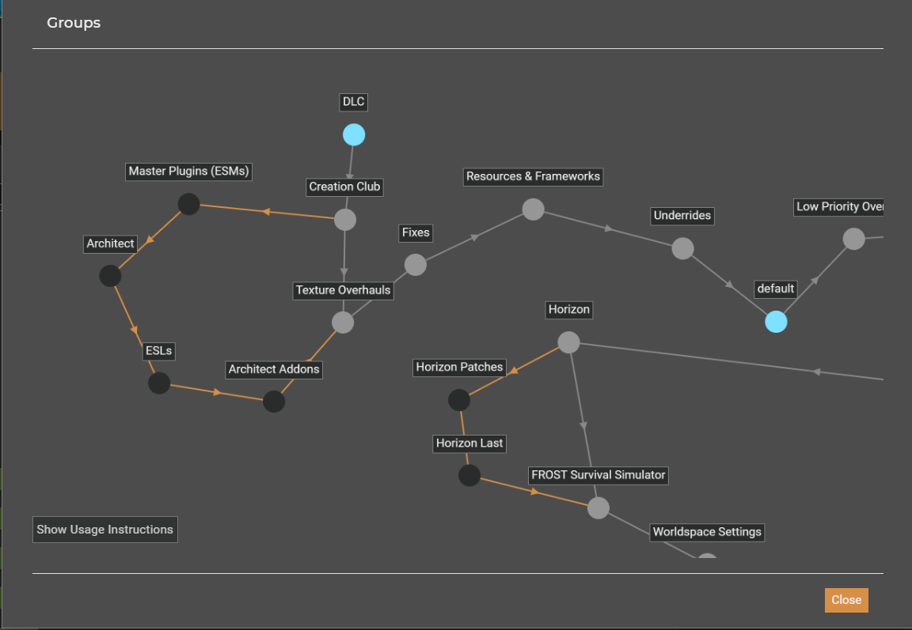
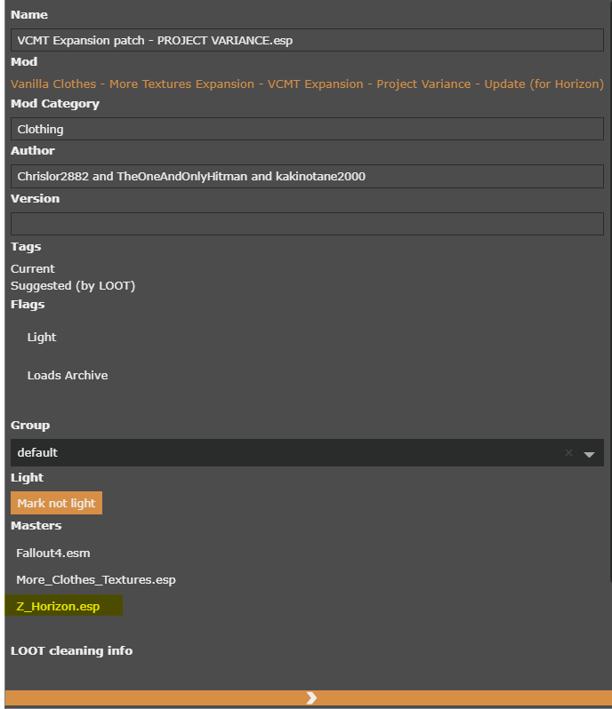
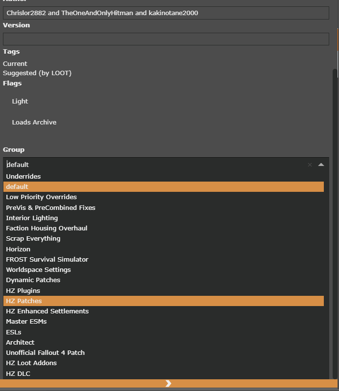

# Horizon Framework Collection and Vortex

This guide will give a more in-depth explanation for using the custom groups that come with the Horizon Framework collection on Nexus.

TLDR: Put ESM plugins in the `Master ESMs group`, put ESL plugins in the `ESLs group`, and patches for Horizon (standalone or replacer ESPs) in the `HZ Patches group`. **Do not make changes to any of the other groups unless you know what you are doing**

For those who don't know the distinction between "standalone patches" and "(ESP) replacer patches":
  - Standalone patches are a new plugin that uses the original mod and Horizon as a master.
  - (ESP) Replacer patches edit the original mod's plugin to make it compatible with Horizon. They should have Horizon as a master as a result.

Since there is no way to manually order plugins in Vortex I had to get creative with groups to get Horizon's plugins into the order recommended by the author, Zawinul.

## New Groups

Lets start by looking at the groups I've added and their purpose.

| Group Name | Purpose |
| :--------- | :------ |
| Unofficial Fallout 4 Patch | This group ensures that UFO4 Patch is the first plugin to load after official Fallout 4 content. Many mods will overwrite the patch, which is expected. **Nothing should be added to this group** |
|Master ESMs | This group is where all other plugins with the ESM extensions should go. Their order within this group is not terribly important but we need all non-Horizon ESMs in this group to ensure Architect is the final loaded ESM. **Users should add ESM plugins to this group** |
| ESLs | This group serves the same purpose as Master ESMs. **Users should add ESLs to this group** |
|Architect | This group is designated to a single plugin, `Architect.ESM`. This ensures it is the final ESM loaded which is important because the rest of Horizon relies on the changes made here. If other mods were to overwrite it, Horizon may not function as expected. **Nothing should be added to this group** | 
| HZ Loot Addons | This group contains two plugins that edit global loot respawns and should need to be the first ESP type plugins. This group ensures they maintain this position. **Nothing should be added to this group** |
| HZ DLC | This group ensures `Z_Horizon_DLC_All.esp` and `Z_Architect_TEMP_1_8_Fix.esp` are loaded directly after `Z_Horizon.esp` as per Zawinul's instructions **Nothing should be added to this group** |
| HZ Plugins | This group contains the other, optional plugins provided in the Horizon installer. This ensures they load after the DLC plugins, but before any patches for horizon. **Nothing should be added to this group** |
| HZ Patches | This group ensures patches for horizon load after official Horizon plugins, but before some that need to be loaded last for compatibility reasons. **Users should add standalone and/or esp replacer patches to this group** |
| HZ Enhanced Settlements | This group ensures a set of plugins from the Horizon installer load last. These plugins are very sensitive to being overwritten so they must load last. **Nothing should be added to this group** |

---

## Requirements for adding plugins to groups

There are only three groups the user should be editing: `Master ESMs`, `ESLs`, and `HZ Patches`. Below are the requirements for adding plugins to each group.

  - Master ESMs - Any plugin that ends in `.esm`
  - ESLs - Any plugin that ends in `.esl`
  - HZ Patches - Plugins that have `Z_Horizon.esp` as a master 

## Adding Plugins to New Groups

I will demonstrate adding plugins to groups using a patch as an example, but the process is similar for the other two groups. To start with, go to the plugins tab in Vortex. Double click the plugin to open the sidebar.

In this example I am going to add `VCMT Expansion patch - PROJECT VARIANCE.esp` to the `HZ Patches` group because it is a replacer patch that has `Z_Horizon.esp` as a master as seen below

Once you have confirmed your plugin is a patch for Horizon open the groups drop down menu and select `HZ Patches`

At this point I suggest manually triggering a resort by pressing the sort button near the top of the page to confirm correct load order position.