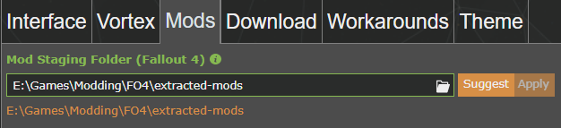
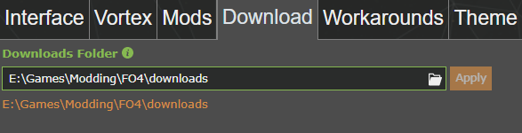
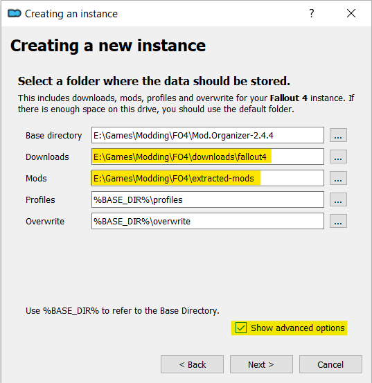

# Migrating Mod Managers

Experimenting with, or changing mod managers sounds difficult. In reality, its quite simple. This guide will show you how to migrate between Vortex and Mod Organizer 1 (MO2).

I will be focusing mainly on moving from Vortex to MO1 since that is the direction most users go.

## Phase 0: Soft Migration

This phase will allow you to keep your Vortex installation intact while testing MO1.

0. In Vortex, disable all of your mods. This helps make the initial MO2 experience less confusing by ensuring there aren't any extra plugins in the \Fallout 4\Data folder.

0. In Vortex, navigate to the settings page.
      
   *Note: I am using custom locations for the next steps so yours will likely look very different.*

    - Go to the "Mods" tab and take note of the staging folder location. I recommend copying the path to a temporary text document.

      

    - Go to the "Downloads" tab and take note of the folder location. Again I recommend copying the path to a temporary text document.

      

0. Now that you have the locations of your staging and downloads folder, double check to make sure all of your mods are disabled then close Vortex.

0. Begin your MO2 install. I prefer the portable instance, but a global instance will work as well.

    - During MO1's installation you will have the option to set folder locations. Click the `Show advanced options` at the bottom.

    - For Downloads use your `Vortex downloads folder`. Be sure to select the game folder for the game you want to manage. In my it case is `\downloads\fallout3`.

    - For Mods use your `Vortex staging folder`. 

      

    - Leave the rest of the options as default.

0. Now you can launch MO2 and all of your mods and downloads will be present.

Now you can start experimenting with MO1. **Remember that any changes to mods you download, install, or delete will be reflected in Vortex.** While you are experimenting with MO2 I recommend avoiding Vortex because of the way it handles enabling mods. 

Vortex uses hard links to make mods appear as if they are in the Fallout 3\Data directory. Because MO2 also tracks the contents of the Fallout 4\Data directory if you use Vortex to enable a mod and then open MO2 you will have a duplicate of the mod, one of which MO2 will not manage well.

***Note: MO1 does not manage F4SE, or ENB installation like Vortex. You will either need to install them manually, or use Kezyma's Root Builder.*** 

  - I have a guide for using Root Builder [here](./mo1-rootbuilder.md) if you are interested.

## Phase 1: Removing Vortex

If you have decided to make the full switch to MO1 there are only a couple things you need to do before removing Vortex.

0. Make a copy of, or move your Vortex Downloads and Staging folders and put them in a new location.

1. Change your MO2 settings so that your Downloads and Mods point to the new locations.

    

2. You can now un-install Vortex without any loss of data.

Congratulations! You have successfully moved from one mod manager to another.