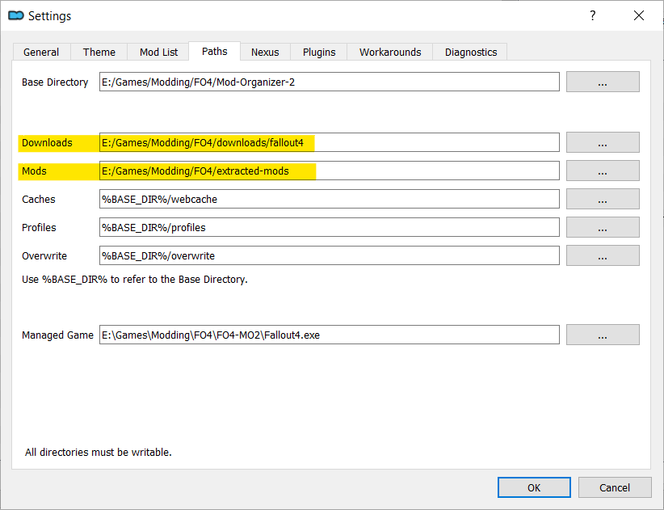

# Migrating Mod Managers

Experimenting with, or changing mod managers sounds difficult. In reality, its quite simple. This guide will show you how to migrate between Vortex and Mod Organizer 2 (MO2).

I will be focusing mainly on moving from Vortex to MO2 since that is the direction most users go.

For this example I will be using Fallout 4 as my game, but the process is the same for any game supported by both MO2 and Vortex.

## Phase 1: Soft Migration

This phase will allow you to keep your Vortex installation and settings intact while testing MO2.

1. In Vortex, disable all of your mods. This helps make the initial MO2 experience less confusing by ensuring there aren't any extra plugins in the `\Fallout 4\Data` folder.

1. In Vortex, navigate to the settings page.
      
   *Note: I am using custom locations for the next steps so yours will likely look very different.*

    - Go to the `Mods` tab and take note of the staging folder location. I recommend copying the path to a temporary text document.

      

    - Go to the `Downloads` tab and take note of the folder location. Again I recommend copying the path to a temporary text document.

      

1. Now that you have the locations of your staging and downloads folder, double check to make sure all of your mods are disabled then close Vortex.

1. Begin your MO2 install. I prefer the portable instance, but a global instance will work as well.

    - During MO2's installation you will have the option to set folder locations. Click the `Show advanced options` at the bottom.

    - For Downloads use your `Vortex downloads folder`. Be sure to select the game folder for the game you want to manage. In my it case is `\downloads\fallout4`.

    - For Mods use your `Vortex staging folder`. 

      

    - Leave the rest of the options as default.

1. Now you can launch MO2 and all of your mods and downloads will be present.

1. To finish your MO2 set up make sure your `fallout4custom.ini` is configured for modding (loading loose files).

    - Open MO2's INI configuration tool.

      

    - Navigate to the fallout4custom.ini tab.

      

    - Ensure there is an `[Archive]` section with `bInvalidateOlderFiles=1` and `sResourceDataDirsFinal=` below it as seen in the picture above.

    **NOTE: There may be other settings in this file already. This is not a problem as long as `[Archive]` is present and `bInvalidateOlderFiles=1` and `sResourceDataDirsFinal=` are below it and not under another section header. (section headers are surrounded by square brackets)**

Now you can start experimenting with MO2. **Remember that any changes to mods you download, install, rename, or delete will be reflected in Vortex.** While you are experimenting with MO2 I recommend avoiding Vortex because of the way it handles enabling mods. 

Vortex uses hard links to make mods appear as if they are in the `\Fallout 4\Data` folder. Because MO2 also tracks the contents of `\Fallout 4\Data` if you use Vortex to enable a mod and then open MO2 you will have a duplicate of the mod, one of which MO2 will not manage well.

If you need a quick runthrough of MO2 sorting system check out my [MO2 Sorting Crash Course](./mo2-sorting-crashcourse.md). It shouldn't take more than a minute or two to read through.

For a more in-depth write up see my MO2 General Guide (coming soon)

***Note: MO2 does not manage F4SE, or ENB installation like Vortex. You will either need to install them manually, or use Kezyma's Root Builder.*** 

  - I have a guide for [installing and using Root Builder](./mo2-rootbuilder.md) if you are interested.

## (Optional) Phase 2 : Removing Vortex Management

If you have decided to make the full switch to MO2 there are only a couple things you need to do before removing Vortex.

1. Be sure to repeat Phase 1 for each game Vortex is managing that you want to move to MO2

1. Make a copy of, or move your Vortex Downloads and Staging folders for each game and put them in a new location.

1. Change your MO2 settings for each game so that your Downloads and Mods point to the new locations.

    ***NOTE: I did not actually change my settings in the image below. It is just to show where they can be found within MO2***

    

1. You can now stop managing games with Vortex, or un-install Vortex completely without any loss of data.

Congratulations! You have successfully moved from one mod manager to another.