# Using MO2 to Manage F4SE, ENB, and More

Mod Organizer 2 cannot install mods that use the base Fallout 4 folder natively (where the `Fallout4.exe` is located). Luckily there is a MO2 plugin called [Root Builder](https://www.nexusmods.com/skyrimspecialedition/mods/31720) that will enable MO2 to manage these applications.

Based on your settings, Root Builder will temporarily copy, or link mods that need to be in the Fallout 4 folder. This makes it so that your Fallout 4 folder remains untouched and you have everything managed from one location, MO2.

## Installing Root Builder

Root Builder [(download here)](https://www.nexusmods.com/skyrimspecialedition/mods/31720) needs to be installed manually. Download it to any location you like, the desktop makes it easy to find for the next steps.

1. Once downloaded, unzip the folder. You should now have a `rootbuilder` folder that contains a few files, another rootbuilder folder, and a shared folder.

1. Locate your MO2's installation folder by launching MO2 and opening the settings. Go to the Path tab and take note of the base directory. 

    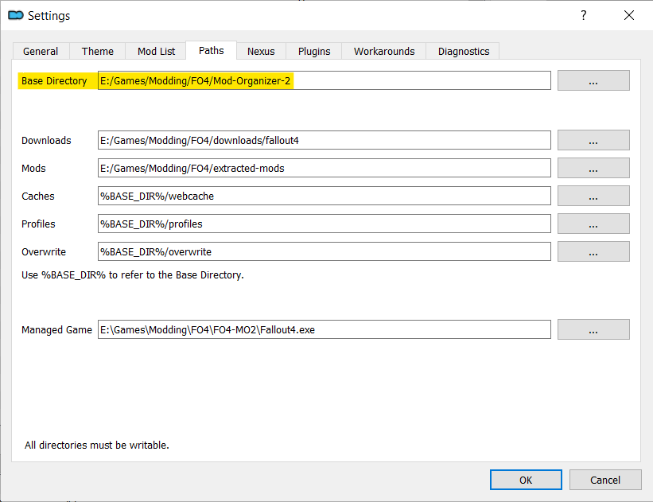

1. Close MO2 and navigate to that folder in your file explorer. Find the `plugins` folder.

    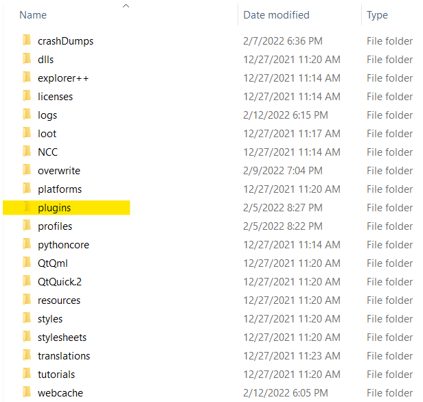

1. Now put the ***entire*** `rootbuilder` folder into the `plugins` folder. 

    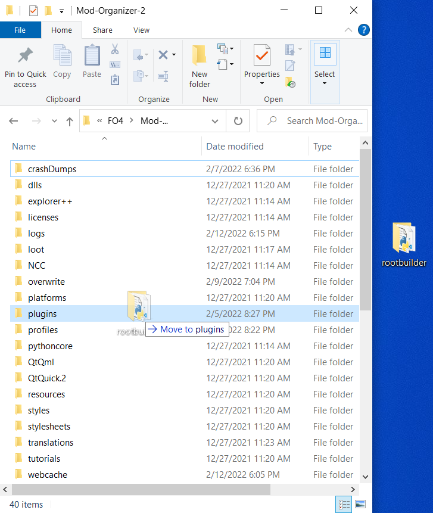

    If you have done this correctly, inside `*\Mod Organizer\plugins\rootbuilder\` you should find two folders, `shared` and `rootbuilder` as well as a file called `__init__.py`

1. Launch MO2 and ensure you have installed it correctly by clicking the tools icon.

    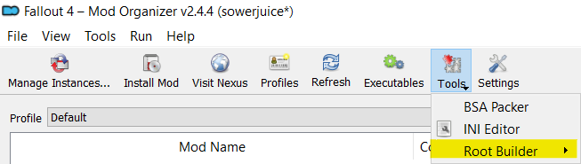

---

## Installing Mods in Root Builder Format

Root builder uses a slightly modified folder structure when installing mods that need to be in the Fallout 4 folder such as F4SE or ENBs. During installation you will need to create a `Root` folder and place any files that need to be in the Fallout 4 folder into it.

I will demonstrate with F4SE since that is the most common.

### F4SE Installation

1. Begin the installation as normal by double clicking the mod in the downloads tab. Expand the drop downs until you see the Data folder. Right click the `Data` folder and create a `Root` folder inside of it.

    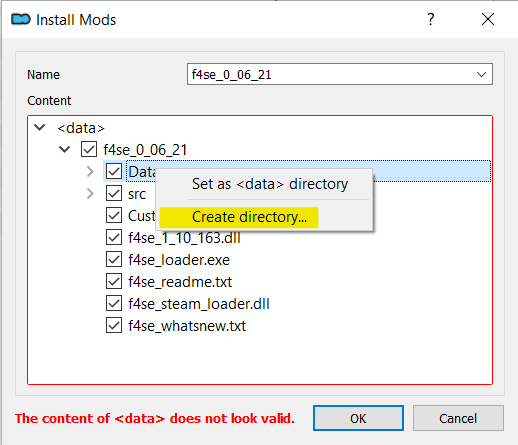

1.  Now put all the files that are required to be in the Fallout 4 directory into the `Root` folder.

    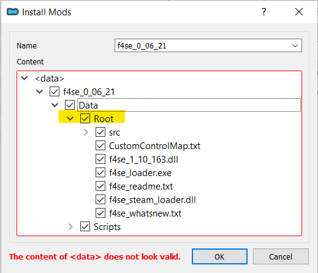
    
1. Finally right click the `Data` folder and select `Set as <data> directory`. Your final folder structure should look like the picture below.

    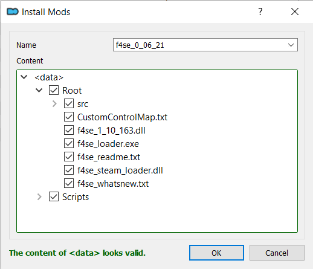

1. Click "OK" and your F4SE installation is now complete! Don't forget to enable the mod on the left panel.

1. To launch FO4 using F4SE you will need to add it as a launcher. Start by clicking the executable button near the top of MO2.

    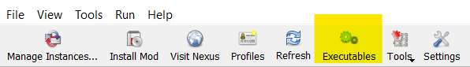 

1. When the executable window opens click the `+` to and select `add from file...`. 

    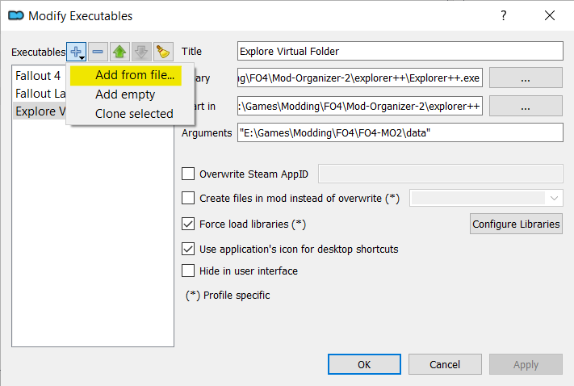 
     
1. Navigate to the F4SE mod you created earlier and select the `f4se_loader.exe`. 

    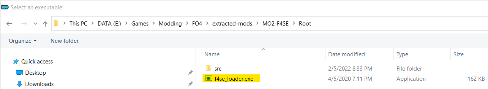

1. After you have selected your F4SE executable be sure click Apply at the bottom of the window. As you can see I gave mine a different title. This is just my preferred naming scheme, you do not need to rename it.

    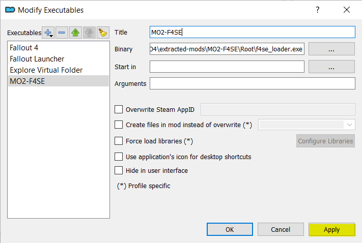

1. Now you can launch F4SE from the dropdown next to the `Run` button in the top right side of MO2.

    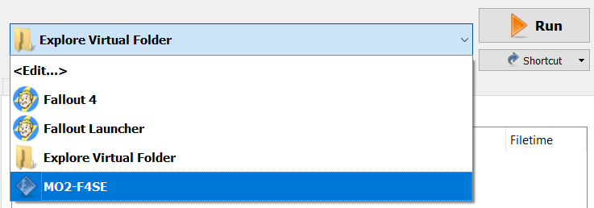

Now F4SE is installed correctly and you can launch your game with all the extra goodies F4SE has to offer.

---

### Other Example Folder Structure

  - Buffout 4 TBB Redistributables
     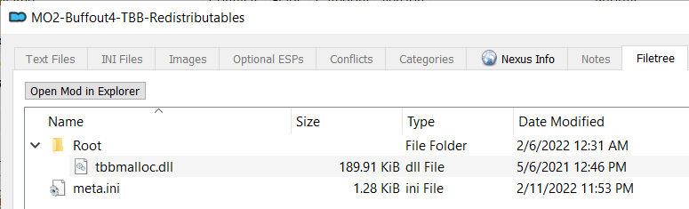

  - ENB
    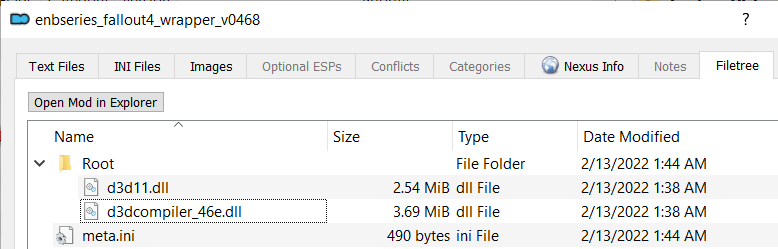

  - xSE Preloader
    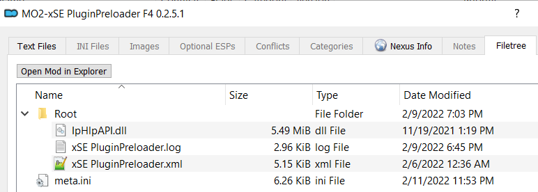