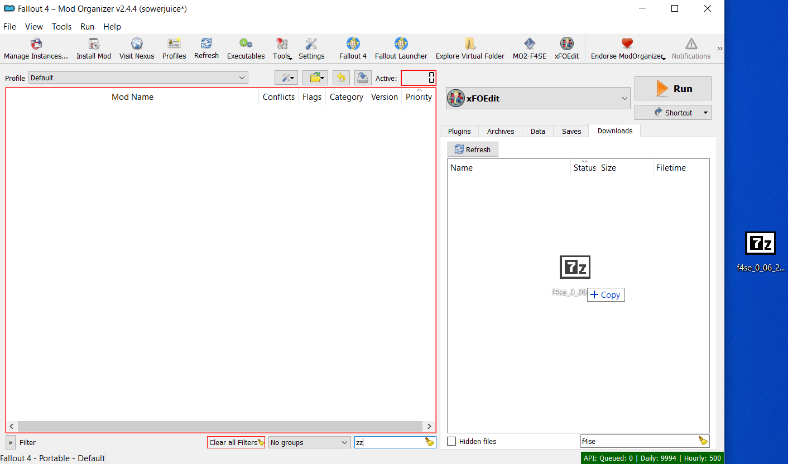
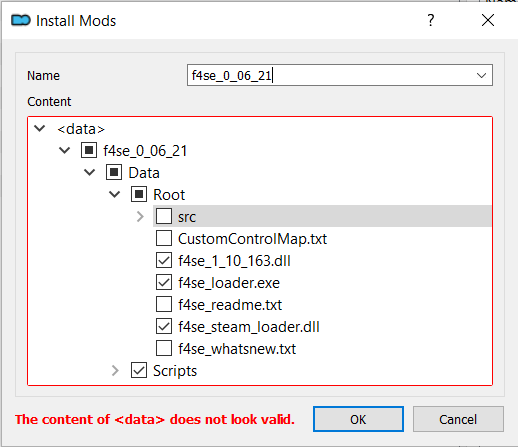

# Using MO2 to Manage Script Extenders, ENBs, and More

Mod Organizer 2 cannot install mods that use the base game folders natively (where the `Fallout4.exe`, or `Skyrim.exe` are located). Luckily Kezyma has made a plugin called [Root Builder](https://www.nexusmods.com/skyrimspecialedition/mods/31720) that will enable MO2 to manage these applications.

Based on your settings, Root Builder will temporarily copy, or link mods that need to be in the Fallout 4 folder. This makes it so that your Fallout 4 folder remains untouched and you have everything managed from one location, MO2.

If you would like to jump straight to a specific section here are some jump points:

  - [Script Extenders (F4SE, SKSE)](#installing-script-extenders)
  - [Engine Fixes (Buffout 4, SSE Engine Fixes)](#installing-engine-fixes)
  - [ENB Binaries (Fallout 4 or Skyrim)](#installing-enb-binaries)
  - [ENB Preset (coming soon)](#enb-preset)
  - [xSE Plugin Preloader (Fallout 4 only)](#installing-xse-plugin-preloader)
  - [Final Notes and Other Resources](#final-notes-and-other-resources)

---

## Installing Mods in Root Builder Format

Root builder uses a slightly modified folder structure when installing mods that need to be in a game's base folder (where the EXE is located) such as script extenders or ENBs. 

During installation you will need to create a `Root` folder inside of the `Data` directory and place any files that need to be in the base game folder (where EXE is located) into the new `Root` folder.

***NOTE: Many mods installed in this way will have a warning that there is no valid game data. This is expected since this is an unofficial plugin MO2 does not recognize the folder structure.***

---

 ### Installing Root Builder 

  
<u><b>expand instructions</u></b>

Root Builder [(download here)](https://www.nexusmods.com/skyrimspecialedition/mods/31720) needs to be installed manually. Download it to any location you like, the desktop makes it easy to find for the next steps.

1. Once downloaded, unzip the folder. You should now have a `rootbuilder` folder that contains a few files, another rootbuilder folder, and a shared folder.

1. Locate your MO2's installation folder by launching MO2 and opening the settings. Go to the Path tab and take note of the base directory. 

    

1. Close MO2 and navigate to that folder in your file explorer. Find the `plugins` folder.

    

1. Now put the ***entire*** `rootbuilder` folder into the `plugins` folder. 

    

    If you have done this correctly, inside `*\Mod Organizer\plugins\rootbuilder\` you should find two folders, `shared` and `rootbuilder` as well as a file called `__init__.py`

1. Launch MO2 and ensure you have installed it correctly by clicking the tools icon.

    

[back to top](#using-mo2-to-manage-script-extenders-enbs-and-more)

---

 ### Installing Script Extenders

  
<u><b>expand instructions</u></b>

For this example I will be installing F4SE but the process is identical for SKSE aside from different file names. I will note them where needed.

1. [Download F4SE](https://f4se.silverlock.org/) and save it to an easy to find location, the desktop works well. Drag the archive into MO2's download tab.

    

1. Begin the installation as normal by double clicking the mod in the downloads tab. Expand the drop downs until you see the `Data` folder. Right click the `Data` folder and create a `Root` folder inside of it.

    

1.  Now put all the files that are required to be in the Fallout 4 (or Skyrim) directory into the `Root` folder.

    
    
1. For F4SE to function only `f4se_1_10_163.dll`, `f4se_steam_loader.dll` and `f4se_loader.exe` are required. You can uncheck everything else in the `Root` folder.

    - Note: for **Skyrim** SKSE the files you need to have checked in the `Root` folder are `skse_1_9_32.dll`, `skse_loader.exe`, and `skse_steam_loader.dll`

    

1. Finally right click the `Data` folder and select `Set as <data> directory`. Your final folder structure should look like the picture below.

    

1. Click "OK" and your F4SE installation is now complete! I renamed mine to `MO2-F4SE` to make it easier to find later. Don't forget to enable the mod on the left panel.

    

1. To launch FO4 using F4SE you will need to add it as a launcher. Start by clicking the executable button near the top of MO2.

     

1. When the executable window opens click the `+` to and select `add from file...`. 

     
     
1. Navigate to the F4SE (or SKSE) mod you created earlier and select the `f4se_loader.exe`(or `skse_loader.exe`). 

    

1. After you have selected your F4SE executable be sure click Apply at the bottom of the window. As you can see I gave mine a different title. This is just my preferred naming scheme, you do not need to rename it.

    

1. Now you can launch F4SE from the dropdown next to the `Run` button in the top right side of MO2.

    

Now F4SE is installed correctly and you can launch your game with all the extra goodies F4SE has to offer.

[back to top](#using-mo2-to-manage-script-extenders-enbs-and-more)

---

### Installing Engine Fixes

  
 <u><b>expand instructions</u></b>

There are two major engine fix tools for Bethesda games. Buffout 4 for **Fallout 4**, and SSE Engine fixes for **Skyrim**.

Both require TBB Redistributables to function so their installation is very similar. Again I will be installing things for Fallout 4, but I will note any differences if required.

1. Begin the installation as normal by double clicking the mod in the downloads tab. Right click the `Data` folder and create a `Root` folder inside of it.

    

1. Move `tbbmalloc.dll` into the new `Root` folder.

    - Note: for **Skyrim** SSE Engine Fixes there will be three files to move into the `Root` folder: `d3dx9_42.dll`, `tbb.dll`,`tbbmalloc.dll`.

    

1. Click `OK` and and you're done! Don't worry about MO2 saying the contents aren't valid, that is expected. Press ignore on the warning that comes up.

    

1. Don't forget to enable on the left pane in MO2!

[back to top](#using-mo2-to-manage-script-extenders-enbs-and-more)

---

### Installing ENB Binaries

  
 <u><b>expand instructions</u></b>

This is a basic install of the ENB Wrapper itself that presets on Nexus require. Once again the installation for Fallout 4 and Skyrim are nearly identical, I will note any differences.

1. [Download](http://enbdev.com/download.html) the enb for your game and save it to a temporary location. The desktop is a good location. Extract it and find the `Wrapper` folder (for **Skyrim** the folder is named `WrapperVersion`). Right click and add it to a compressed folder. You can use whatever tool you would like for this as long as you end up with a ZIP or 7z archive.

    

1. Drag your new archive into MO2. I have renamed my archive but you could leave it as is if you like.

    

1. In MO2 begin the installation as normal by double clicking the mod in the downloads tab. Right click the `Data` folder and create a `Root` folder inside of it.

    

1. We only need `d3d11.dll` and `d3dcompiler_46e.dll` for this install (same for Skyrim). Move them into the new `Root` folder and uncheck everything else.

    
    
1. Click `OK` and and you're done! Don't worry about MO2 saying the contents aren't valid, that is expected. Press ignore on the warning that comes up.

    

1. Don't forget to enable on the left pane in MO2!

[back to top](#using-mo2-to-manage-script-extenders-enbs-and-more)

---

<u><b>ENB Preset</u></b> - Coming Soon

---

### Installing xSE Plugin Preloader

  
<u><b>expand instructions</u></b>

   
1. Begin the installation as normal by double clicking the mod in the downloads tab. Right click the `Data` folder and create a `Root` folder inside of it.

    
   
1. Move `lpHlpAPI.dll` and `xSE PluginPreloader.xml` into the new `Root` folder

    

1. Click `OK` and and you're done! Don't worry about MO2 saying the contents aren't valid, that is expected. Press ignore on the warning that comes up.
   
    

1. Don't forget to enable on the left pane in MO2!

[back to top](#using-mo2-to-manage-script-extenders-enbs-and-more)

---

## Final Notes and Other Resources

Bigglesworth has also made a guide for Root Builder with his custom repacks if you are interested. Find it [here](https://docs.google.com/document/d/1G_atn4azIh0JPrvBVAV6PhJ5kkrVnaktbBi_PJRpzV4/edit?usp=sharing)!

---

If the red "x" flags in MO2 bother you they will go away if you right click the mod and select "Ignore Missing Data"

[back to top](#using-mo2-to-manage-script-extenders-enbs-and-more)