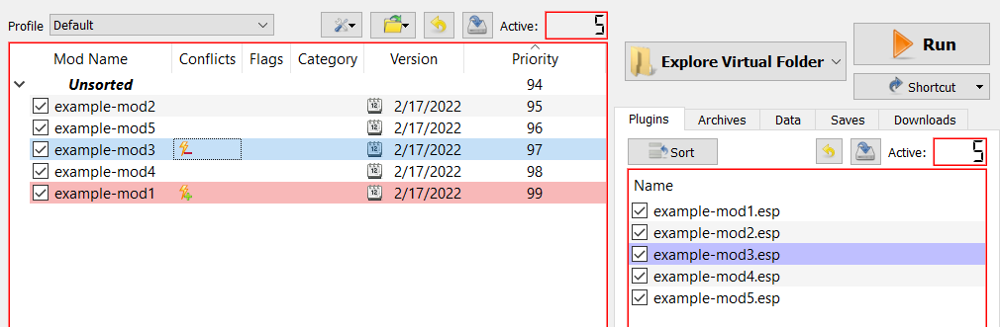
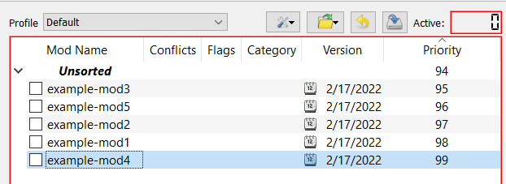

# Mod Organizer 2: Sorting Crash Course

The goal of this document is to get you familiarized with the basics of how to sort mods and plugins with MO2. This will not be an in-depth guide for everything MO2. If you would like to see more about mod naming schemes, setting up separators, etc. have a look at my General MO2 Guide (coming soon).

  - Note: MO2 does not handle mods that need to be in a game's base folder (where the EXE is located). If you would like to have MO2 handle mods like that I recommend using [Kezyma's Root Builder](https://www.nexusmods.com/skyrimspecialedition/mods/31720). I have a [guide for installing and using](./mo2-rootbuilder.md) it if you have a hard time following his instructions.

## MO2's Interface


  There are two panes presented in MO2. The Left is the `mods` pane, and is connected to `modlist.txt` which is generated by MO2. The Right is the `loadorder` pane, and is connected to `loadorder.txt` which is also generated by MO2.
  
  These lists can be found in the profile folder. It is a good idea to provide both of these files when asking for help with modding

    

---

## Sorting basics

Generally speaking it is best practice to have your Left and Right panes in roughly the same order. This ensures that any file overwrites will match with plugin overwrites. If you have large differences in the Left and Right panes your game will likely be unstable and could cause issues with mods that would normally be compatible with each other if they were in the proper load order.

In this example I have 5 mods. I want their load order and priority to be:

```
example-mod3
example-mod5
example-mod2
example-mod4
example-mod1
```
As you can see here neither pane represents my desired load order. I could simply drag and drop both panes independently to get the order I want, but this could take quite some time if I had more than five mods.

  - Note the lightning bolts on `example-mod3` and `example-mod1`. This indicates a file conflict between the two. If you click on one of the mods it will highlight the mod(s) that have file conflicts.


   


  - This could be a serious conflict because `example-mod3` has a higher plugin priority (Right Pane) than `example-mod1`; However `example-mod3's` file assets are being overwritten by `example-mod1` on the Left Pane. This means `example-mod3's` expected mesh, texture, etc. changes are missing which could cause unexpected/unwanted textures to show up at best, or CTDs at worst.

To sort these mods I will disable all my mods by right clicking a mod, expanding `All Mods` at the top, and selecting `disable all`

   

Now I can focus on just the Left pane. I can just drag and drop all the mods until they are in the desired order while disabled. 

   

Finally I can go from the top of my list on the Left Pane and enable each mod individually. They will automatically show up in the Right Pane in the correct/expected order.

  - Note: mods with multiple plugins may require some additional rearranging in the Right Pane. If this is the case ensure the mod's position in the Left Pane roughly matches the position of the lowest plugin on the Right Pane.


That is all for this guide! Have fun with your game!
