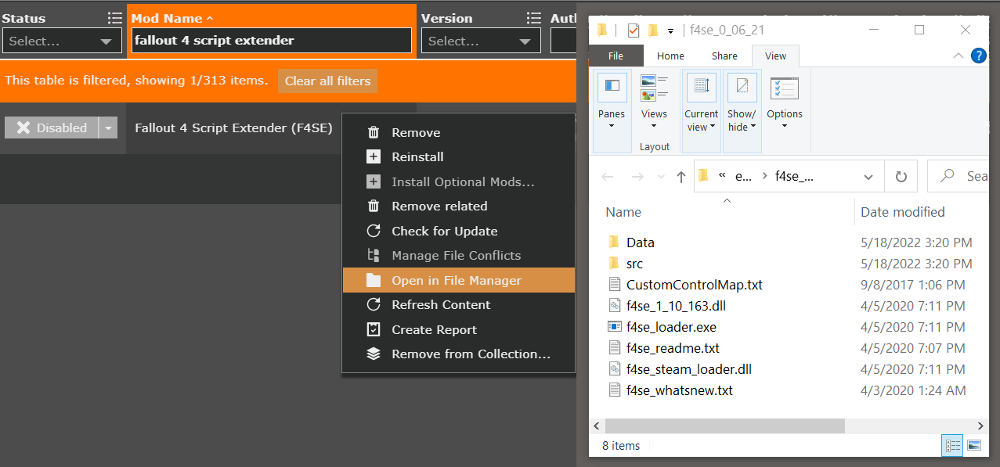
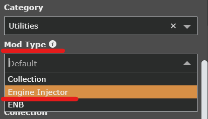
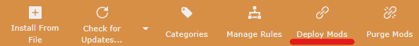
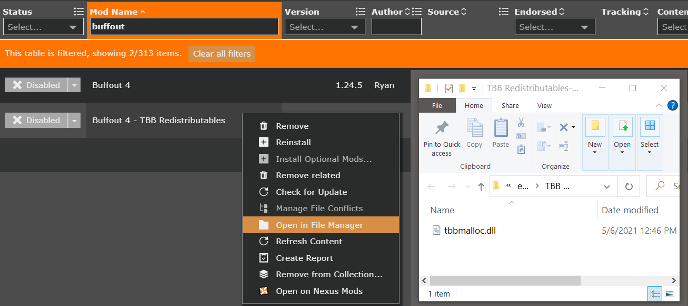
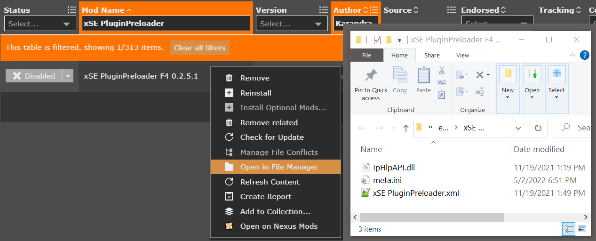

# Vortex - Managing F4SE, Buffout 4, and More

## General Information

I have found that many mods and tools that require files to be placed in the root `Fallout 4` folder (where `Fallout4.exe` is located) are lacking installation instructions for mod managers. While these installation instructions still work, they can be difficult to follow. In my opinion using a mod manager to handle these installations has several advantages over manual installation:

  1. In my opinion they are easier to install with this method.

  1. Using a mod manager to install these mods / tools makes it easier to track files.

  1. Trouble shooting bad / incorrect installations is much easier because you know exactly what files the mod provides.

  1. The user does not have to make any changes to the root `Fallout 4` folder.

      - This keeps the `Fallout 4` folder in a vanilla state which is always my recommendation. (In the case of Vortex you can now purge back to a vanilla state easily)

This guide is specific for Vortex. Check my [MO2 Root Builder Guide](./mo2-rootbuilder.md) for how to accomplish a similar installation method with Mod Organizer 2.

***T.L.D.R. Instructions:***

  1. For mods and tools that need to be in the root `Fallout 4` folder double click the mod to open the mod information tab and change the `Mod Type` from `Default` to `Engine Injector`. 

  1. Redeploy mods to ensure Vortex updates the settings.

---

## Instructions

These instructions assume the reader knows to download, and import mods and tools into Vortex if necessary.

  - Note: The goal of these instructions is to teach a method, not to provide specific instructions for each and every mod / tool.

---

### Installing mods and tools ***with*** files that need to be in the `Data` folder (F4SE)

I will be using [F4SE](https://f4se.silverlock.org/) as an example for this method. However this will work for any mod or tool that is packed with contents that need to go in both the root `Fallout 4` folder and the `Fallout 4/Data` folder. (Yes, Vortex will likely install F4SE for you, but its a perfect example.)

  
<u><b>expand instructions</u></b>

1. Download and install Fallout 4 Script Extender.
    - Note: This mod includes a `Data` folder. There is a chance that not all mods will be packed like this. If you encounter a mod that has root `Fallout 4` files and `Fallout 4/Data`files all together and a `Data` folder is not present after installing the mod be sure to make one and put the appropriate files in it.

    

1. Double click the mod to open the mod information tab. Scroll down to the bottom and change the `Mod Type` from `Default` to `Engine Injector`. 

    

1. Re-deploy mods to ensure Vortex updates the new setting and you are done.

    

[back to top](#installing-mods-and-tools-with-files-that-need-to-be-in-the-data-folder-f4se)

---

### Installing mods and tools ***without*** files that need to go into the `Data` folder (Buffout 4)

I will be using [Buffout 4](https://www.nexusmods.com/fallout4/mods/47359) as an example for this method. However, this method will work for any mod or tool that only has files that need to be installed into the root `Fallout 4` folder.

  
<u><b>expand instructions</u></b>

1. Download and install **both** main files from [Buffout 4](https://www.nexusmods.com/fallout4/mods/47359), as well as [Address Libraries](https://www.nexusmods.com/fallout4/mods/47327), and [xSE PluginPreloader](https://www.nexusmods.com/fallout4/mods/33946).
  - Note: If you check the folder contents of `Buffout 4 - TBB Redistributables` and `xSE PluginPreloader` (the two mods that need their `Mod Type` changed) you will see the only files present are ones that need to be put into the root `Fallout 4` folder.

    
    

1. Double click `Buffout 4 - TBB Redistributables` to open the mod information tab. Scroll down to the bottom and change the `Mod Type` from `Default` to `Engine Injector`. 

    

1. You guessed it, now do the same for `xSE PluginPreloader`. Double click `xSE PluginPreloader` to open the mod information tab. Scroll down to the bottom and change the `Mod Type` from `Default` to `Engine Injector`.

1. If you haven't already, redeploy mods to ensure Vortex updates the settings and you're done.

    

[back to top](#installing-mods-and-tools-without-files-that-need-to-go-into-the-data-folder-buffout-4)

---

## Other Resources

For more of my guides and information please check the [main index](./README.md) of this repository.